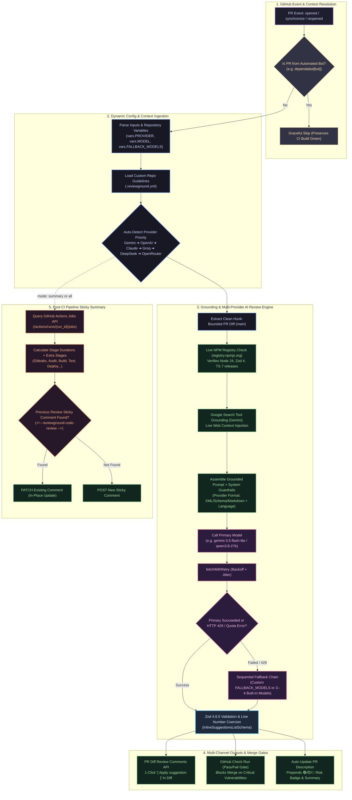

<div align="center">

# 🛡️ ReviewGround

**The Universal, High-Precision AI Code Reviewer & Post-CI Verification Engine for GitHub Actions.**

[](LICENSE)
[](https://github.com/marketplace/actions/reviewground)
[](package.json)
[](package.json)
[](package.json)
[](#-how-to-get-api-keys--configure-github)
[](package.json)

*Stop paying $50/seat/month for proprietary AI code review bots.*  
**ReviewGround** brings enterprise-grade AI code review, live package registry grounding, 1-click commit suggestions, and sticky CI summaries directly to your repository with your own API keys.

---

</div>

## 🌟 Why ReviewGround?

| Feature | Standard AI Review Bots | ReviewGround |
|---|:---:|:---:|
| **Pricing** | $20–$60 / developer / month | **100% Free & Open-Core (BYOK)** |
| **Provider Freedom** | Locked into single proprietary vendor | **Gemini, OpenAI, Claude, Groq, DeepSeek, OpenRouter, Ollama** |
| **Model Customization** | Fixed models only | **Full Custom Model Override (`model: '...'`)** |
| **Multi-Host Safety** | Hijacks open models to hardcoded hosts | **Preserves Custom & OpenRouter host selections (Qwen, Llama)** |
| **Zero-Commit Control** | Must edit YAML & commit for model changes | **Change Provider/Model via GitHub Repo Variables** |
| **Hallucination Prevention** | None (flags modern packages as non-existent) | **Real-Time NPM Registry Search Grounding** |
| **Commit Suggestions** | Markdown text diff blocks | **Native GitHub 1-Click `[ Apply suggestion ]` Buttons** |
| **PR Comment Noise** | Spams 5–10 new comments per PR push | **Single In-Place Sticky Comment (Updated via PATCH)** |
| **CI Duration Tracking** | Not supported | **Workflow Jobs API Duration Metrics (`9s`, `1m 24s`)** |
| **Local / Air-Gapped AI** | Not supported | **Self-hosted Ollama / Together AI / vLLM compatible** |

---

## 🔑 How to Get API Keys & Configure GitHub

You bring your own API key(s) from any provider you prefer. ReviewGround supports multiple keys with automatic failover!

### 1. Direct Links to Get Your API Keys

| Provider | Recommended Baseline | Free Tier Available? | Get Your API Key (Direct Link) |
|---|---|:---:|---|
| **Google Gemini** | `gemini-3.5-flash-lite` | ✅ **Yes** | 🔗 [Google AI Studio](https://aistudio.google.com/app/apikey) |
| **Groq LPU** | `qwen/qwen3.8-27b` | ✅ **Yes** | 🔗 [Groq Console](https://console.groq.com/keys) |
| **OpenRouter** | `qwen/qwen-2.5-coder-32b-instruct` | ✅ **Yes (15+ free models)** | 🔗 [OpenRouter Keys](https://openrouter.ai/keys) |
| **OpenAI** | `gpt-4o-mini` | Paid / Credits | 🔗 [OpenAI Platform](https://platform.openai.com/api-keys) |
| **Anthropic Claude** | `claude-3-5-haiku` | Paid / Credits | 🔗 [Anthropic Console](https://console.anthropic.com/settings/keys) |
| **DeepSeek** | `deepseek-chat` | Paid (Low Cost) | 🔗 [DeepSeek Platform](https://platform.deepseek.com/api_keys) |
| **Custom / Ollama** | Any local model | Free (Self-Hosted) | `http://localhost:11434/v1` |

---

### 2. How to Add API Keys & Settings in Your GitHub Repository

You **never** need to commit API keys to your code. Manage them securely in GitHub:

#### Step A: Store API Keys in GitHub Secrets
1. In your GitHub repository, click **Settings** (top tab).
2. In the left navigation menu, navigate to **Secrets and variables** → **Actions**.
3. Under the **Repository secrets** section, click **New repository secret**.
4. Add any keys you have:
   - Name: `GEMINI_API_KEY` | Secret: `AIzaSy...`
   - Name: `GROQ_API_KEY` | Secret: `gsk_...`
   - Name: `OPENROUTER_API_KEY` | Secret: `sk-or-v1-...`
   - Name: `OPENAI_API_KEY` | Secret: `sk-proj-...`
   - Name: `ANTHROPIC_API_KEY` | Secret: `sk-ant-...`
   - Name: `DEEPSEEK_API_KEY` | Secret: `sk-...`

#### Step B: Zero-Commit Model, Provider & Fallback Control (GitHub Variables)
Want to switch models, providers, or fallback chains without editing your `.github/workflows` YAML or creating git commits?
1. In **Settings** → **Secrets and variables** → **Actions**, click the **Variables** tab.
2. Click **New repository variable**:
   - Name: `PROVIDER` → Value: `gemini` (or `openrouter`, `openai`, `anthropic`, `groq`, `deepseek`)
   - Name: `MODEL` → Value: `gemini-3.5-flash-lite` (or `gpt-4o-mini`, `qwen/qwen3.8-27b`)
   - Name: `FALLBACK_MODELS` (or e.g. `GEMINI_FALLBACK_MODELS`, `GROQ_FALLBACK_MODELS`) → Value: `gemini-3.1-flash-lite,gemini-flash-latest`
3. Whenever you want to experiment with a new model or customize fallback chains, simply update the variable value in GitHub settings. **ReviewGround picks it up on the very next PR run automatically!**

---

### 3. Priority Hierarchy & Automatic Fallback Chains (Serial Kram)

#### ❓ Is `provider` or `model` mandatory to configure?
**No, completely optional!** If you only provide your API keys and omit `provider` and `model`, ReviewGround auto-detects your keys and uses the optimal default baseline model.

#### ❓ What happens if you configure ALL API keys? (Default Priority Order)
When multiple keys are provided without a preference, ReviewGround uses this battle-tested priority order. Each provider is armed with **3–4 built-in fallback models**. If any primary model encounters a quota limit (HTTP 429), model retirement, or downtime, ReviewGround seamlessly falls through the chain:

| Priority Rank | Provider | Default Primary Model | Built-In Fallback Chain (3–4 Models) | Key Strength |
|:---:|---|---|---|---|
| **#1 (Default)** | **Google Gemini** | `gemini-3.5-flash-lite` | `gemini-3.1-flash-lite` ➔ `gemini-flash-latest` ➔ `gemini-flash-lite-latest` ➔ `gemini-3-flash-preview` | Live Google Search Tool Grounding |
| **#2** | **OpenAI** | `gpt-4o-mini` | `gpt-4o` ➔ `gpt-4-turbo` ➔ `gpt-3.5-turbo` | Precision DevSecOps & code analysis |
| **#3** | **Anthropic Claude** | `claude-3-5-haiku` | `claude-3-5-sonnet` ➔ `claude-3-haiku` ➔ `claude-3-sonnet` | Deep reasoning & architectural insight |
| **#4** | **Groq LPU** | `qwen/qwen3.8-27b` | `openai/gpt-oss-120b` ➔ `openai/gpt-oss-20b` ➔ `allam-2-7b` ➔ `llama-3.3-70b-versatile` | Ultra-fast LPU inference (under 1s) |
| **#5** | **DeepSeek** | `deepseek-chat` | `deepseek-reasoner` (R1) | Cost-effective reasoning & logic |
| **#6** | **OpenRouter** | `qwen/qwen-2.5-coder-32b-instruct` | `meta-llama/llama-3.3-70b-instruct` ➔ `mistralai/mistral-small-24b` ➔ `google/gemini-2.0-flash-exp:free` ➔ `liquid/lfm-2.5-2.6b:free` | 200+ models with dedicated routing |
| **#7** | **Custom / Ollama** | `llama3.2` | User-defined | Self-hosted & air-gapped endpoints |

#### 🎯 Can users define their own custom fallback models?
**Yes!** If you want fallback to strictly occur across your chosen models instead of defaults:
- Set via GitHub Repository Variable: `FALLBACK_MODELS="gemini-3.1-flash-lite,gemini-flash-latest"` (or provider-specific: `GEMINI_FALLBACK_MODELS`, `GROQ_FALLBACK_MODELS`, `OPENAI_FALLBACK_MODELS`, `ANTHROPIC_FALLBACK_MODELS`, `DEEPSEEK_FALLBACK_MODELS`, `OPENROUTER_FALLBACK_MODELS`).
- Or pass via Action Input: `fallback-models: "gemini-3.1-flash-lite,gemini-flash-latest"`.
- When set, ReviewGround **strictly restricts fallbacks to your specified models**, guaranteeing that only models you approved will ever run.

#### ❓ What if a model like Qwen or Llama is hosted on another third-party provider?
ReviewGround features **Third-Party Host Preservation**:
- If you specify `provider: 'openrouter'` or `provider: 'custom'` (pointing to Together AI, Fireworks, or Ollama), ReviewGround **NEVER hijacks or reroutes your Qwen or Llama model to Groq**. It executes strictly against your specified provider.
- Models with organization namespaces (e.g. `qwen/qwen-2.5-coder-32b-instruct`, `meta-llama/llama-3.3-70b-instruct`) are correctly recognized as OpenRouter/Multi-host models.

#### ❓ What happens if you specify a mismatched Provider and Model (e.g. Provider = Google, Model = DeepSeek)?
ReviewGround features **Smart Mismatch Auto-Routing**:
- If `provider: 'gemini'` and `model: 'deepseek-chat'` are passed:
  1. ReviewGround inspects the model prefix and detects that `deepseek-chat` belongs to DeepSeek.
  2. If `DEEPSEEK_API_KEY` is present, it **automatically routes the request to DeepSeek** to prevent an invalid model API error!
  3. If DeepSeek is not configured, Gemini will attempt it, catch the invalid model response, and **automatically fall back to `gemini-3.5-flash-lite`** without failing your CI pipeline!

---

## ⚡ Execution Modes (`mode`)

ReviewGround operates in three execution modes configured via the `mode` input (`mode: review | summary | all`):

| Mode | Intended Use | Behavior |
|---|---|---|
| **`mode: review`** *(Recommended for Code Review)* | **AI Code Review Only** | Runs universal multi-provider AI review, live npm package registry grounding, and 1-click interactive diff suggestions. **Post-CI verification table is completely suppressed.** |
| **`mode: summary`** | **Post-CI Verification Only** | Queries GitHub Actions Workflow Jobs API to render duration metrics (`14s`, `1m 20s`) and status badges for Gitleaks, Dependency Audit, Build, Unit Tests, and custom stages. |
| **`mode: all`** *(Default)* | **Unified Review & CI Verification** | Runs AI review first, then appends the CI verification summary to the single sticky comment. Features **Smart CI Auto-Skip**: If no CI stages (`gitleaks-result`, `build-result`, etc.) or matching workflow jobs are detected, the CI table is **automatically omitted** to prevent noisy `unknown` status rows. |

---

## 🚀 Quickstart Workflows

Create `.github/workflows/reviewground.yml` in your project:

### Option 1: Universal Zero-Commit Setup (Recommended)
This workflow handles API keys from secrets and allows runtime provider/model switching via GitHub Repository Variables (`vars.*`):

```yaml
name: ReviewGround AI Code Review

on:
  pull_request:
    types: [opened, synchronize, reopened]

permissions:
  contents: read
  pull-requests: write
  actions: read

jobs:
  review:
    runs-on: ubuntu-latest
    steps:
      - uses: actions/checkout@v7
        with:
          fetch-depth: 0 # Required for full git diff calculation

      - uses: arungupta1526/ReviewGround@v1
        with:
          github-token: ${{ secrets.GITHUB_TOKEN }}
          mode: review
        env:
          # API Keys (Stored in Repository Secrets)
          GEMINI_API_KEY: ${{ secrets.GEMINI_API_KEY }}
          GROQ_API_KEY: ${{ secrets.GROQ_API_KEY }}
          OPENROUTER_API_KEY: ${{ secrets.OPENROUTER_API_KEY }}
          OPENAI_API_KEY: ${{ secrets.OPENAI_API_KEY }}
          ANTHROPIC_API_KEY: ${{ secrets.ANTHROPIC_API_KEY }}
          DEEPSEEK_API_KEY: ${{ secrets.DEEPSEEK_API_KEY }}
          # Zero-Commit Dynamic Controls (Configured in Repository Variables)
          PROVIDER: ${{ vars.PROVIDER || '' }}
          MODEL: ${{ vars.MODEL || '' }}
```

---

### Option 2: Minimal Gemini Setup (Free Tier & Search Grounded)

```yaml
name: ReviewGround Gemini Review

on:
  pull_request:
    types: [opened, synchronize, reopened]

permissions:
  contents: read
  pull-requests: write
  actions: read

jobs:
  review:
    runs-on: ubuntu-latest
    steps:
      - uses: actions/checkout@v7
        with:
          fetch-depth: 0

      - uses: arungupta1526/ReviewGround@v1
        with:
          github-token: ${{ secrets.GITHUB_TOKEN }}
          mode: review
          gemini-api-key: ${{ secrets.GEMINI_API_KEY }}
```

---

### Option 3: OpenRouter Setup (Access to 200+ Models)

```yaml
name: ReviewGround OpenRouter Review

on:
  pull_request:
    types: [opened, synchronize, reopened]

permissions:
  contents: read
  pull-requests: write
  actions: read

jobs:
  review:
    runs-on: ubuntu-latest
    steps:
      - uses: actions/checkout@v7
        with:
          fetch-depth: 0

      - uses: arungupta1526/ReviewGround@v1
        with:
          github-token: ${{ secrets.GITHUB_TOKEN }}
          mode: review
          openrouter-api-key: ${{ secrets.OPENROUTER_API_KEY }}
          model: 'qwen/qwen-2.5-coder-32b-instruct' # Or any model on OpenRouter!
```

---

### Option 4: Local / Self-Hosted LLM (Ollama or Together AI)

```yaml
name: ReviewGround Self-Hosted Review

on:
  pull_request:
    types: [opened, synchronize, reopened]

permissions:
  contents: read
  pull-requests: write
  actions: read

jobs:
  review:
    runs-on: ubuntu-latest
    steps:
      - uses: actions/checkout@v7
        with:
          fetch-depth: 0

      - uses: arungupta1526/ReviewGround@v1
        with:
          github-token: ${{ secrets.GITHUB_TOKEN }}
          mode: review
          provider: 'custom'
          llm-base-url: 'http://localhost:11434/v1' # Or https://api.together.xyz/v1
          llm-api-key: ${{ secrets.LLM_API_KEY }}
          model: 'llama3.2'
```

---

### Option 5: Full End-to-End CI Pipeline with Verification Summary (`mode: all`)

Combine AI code review with automated stage verification in a multi-job workflow:

```yaml
name: CI Pipeline & AI Review

on:
  pull_request:
    types: [opened, synchronize, reopened]

permissions:
  contents: read
  pull-requests: write
  actions: read

jobs:
  gitleaks:
    runs-on: ubuntu-latest
    steps:
      - uses: actions/checkout@v7
      - name: Secret Scan
        run: echo "Gitleaks scan complete"

  build-and-test:
    runs-on: ubuntu-latest
    steps:
      - uses: actions/checkout@v7
      - run: npm ci && npm test && npm run build

  reviewground:
    needs: [gitleaks, build-and-test]
    if: always()
    runs-on: ubuntu-latest
    steps:
      - uses: actions/checkout@v7
        with:
          fetch-depth: 0

      - uses: arungupta1526/ReviewGround@v1
        with:
          github-token: ${{ secrets.GITHUB_TOKEN }}
          mode: all
          gemini-api-key: ${{ secrets.GEMINI_API_KEY }}
          gitleaks-result: ${{ needs.gitleaks.result }}
          build-result: ${{ needs.build-and-test.result }}
          test-result: ${{ needs.build-and-test.result }}
```

---

## 🏗️ End-to-End Architecture & Workflow



---

## 🚀 Key Architectural Pillars

### 1. 🌐 Google Search Grounding & NPM Live Registry Check
LLMs trained with static cutoffs frequently hallucinate that newly released major versions or frameworks do not exist (e.g. Node 24, Next.js 15, Zod 4, TypeScript 7).  
ReviewGround parses every package added in your diff and proactively inspects `registry.npmjs.org` in real-time, injecting verified releases as ground-truth context before prompting the LLM. For Gemini, Google Search tool grounding (`tools: [{ googleSearch: {} }]`) is enabled automatically with graceful fallback.

### 2. ⚡ Native 1-Click Commit Suggestions on PR Diffs
Instead of dumping passive code blocks in a comment, ReviewGround formats fixes into the GitHub Pull Request Review Comments API.  
Developers can apply fixes with native GitHub buttons directly in the **Files changed** tab:
```
┌────────────────────────────────────────────────────────┐
│  src/auth/jwt.ts:42                                    │
│  🤖 ReviewGround 1-Click Code Suggestion               │
│  ```suggestion                                         │
│    const payload = jwt.verify(token, secretKey);       │
│  ```                                                   │
│  [ Apply suggestion ]   [ Add suggestion to batch ]    │
└────────────────────────────────────────────────────────┘
```
All line numbers are validated and safely coerced with **Zod 4.6.5** schemas (`InlineSuggestionsListSchema`), preventing runtime crashes when LLMs return string line numbers.

### 3. 📊 Post-CI Single Sticky PR Summary & Stage Durations
ReviewGround detects previous comments using a persistent HTML marker (`<!-- reviewground-code-review -->`) and updates them using `PATCH /repos/{owner}/{repo}/issues/comments/{id}`.  
- New commits update the existing review in-place without comment spam.
- Queries GitHub Actions Workflow Jobs API (`/actions/runs/{run_id}/jobs`) to compute exact execution durations:

| Pipeline Stage | Status | Duration | Verification Summary |
|---|:---:|:---:|---|
| 🐍 **1. Gitleaks Secret Scan** | ✅ Passed | `8s` | Secret, token & credential leak detection |
| 🐍 **2. Dependency Audit** | ✅ Passed | `14s` | Security vulnerability & zero-CVE audit |
| 🐍 **3. Build & Compilation** | ✅ Passed | `42s` | Clean build compilation & type safety |
| 🐍 **4. Test Verification** | ✅ Passed | `1m 15s` | Unit tests & invariant suites |

---

## 🛠️ Complete Configuration Reference

### Action Inputs & Environment Variables

Every setting can be passed either as an Action Input (`with:`) or as an Environment Variable / Secret (`env:`):

| Setting | Action Input (`with:`) | Environment Variable (`env:` / `vars.*`) | Default |
|---|---|---|:---:|
| **GitHub Token** | `github-token` | `GITHUB_TOKEN` | `${{ github.token }}` |
| **Execution Mode** | `mode` | `REVIEWGROUND_MODE`, `MODE` | `all` (`review` \| `summary` \| `all`) |
| **Preferred Provider** | `provider` | `REVIEWGROUND_PROVIDER`, `PROVIDER`, `LLM_PROVIDER` | *Auto-detected* |
| **Model Override** | `model` | `REVIEWGROUND_MODEL`, `MODEL`, `LLM_MODEL` | *Provider default* |
| **Fallback Models** | `fallback-models` | `FALLBACK_MODELS`, `<PROVIDER>_FALLBACK_MODELS` | *Built-in 3–4 models* |
| **Gemini API Key** | `gemini-api-key` | `GEMINI_API_KEY`, `GOOGLE_API_KEY` | — |
| **Groq API Key** | `groq-api-key` | `GROQ_API_KEY` | — |
| **OpenRouter API Key**| `openrouter-api-key`| `OPENROUTER_API_KEY` | — |
| **OpenAI API Key** | `openai-api-key` | `OPENAI_API_KEY` | — |
| **Anthropic API Key**| `anthropic-api-key` | `ANTHROPIC_API_KEY`, `CLAUDE_API_KEY` | — |
| **DeepSeek API Key** | `deepseek-api-key` | `DEEPSEEK_API_KEY` | — |
| **Custom Base URL** | `llm-base-url` | `LLM_BASE_URL`, `OPENAI_BASE_URL` | — |
| **Custom API Key** | `llm-api-key` | `LLM_API_KEY` | — |
| **Search Grounding** | `enable-search-grounding`| `ENABLE_SEARCH_GROUNDING` | `true` |
| **Inline Suggestions**| `enable-inline-suggestions`| `ENABLE_INLINE_SUGGESTIONS`| `true` |
| **NPM Verification** | `enable-npm-verify` | `ENABLE_NPM_VERIFY` | `true` |
| **Base Branch** | `base-branch` | `REVIEWGROUND_BASE_BRANCH`, `BASE_BRANCH` | `main` |
| **LLM Temperature** | `temperature` | `REVIEWGROUND_TEMPERATURE`, `LLM_TEMPERATURE` | `0.2` |
| **Max Tokens** | `max-tokens` | `REVIEWGROUND_MAX_TOKENS`, `LLM_MAX_TOKENS` | `2048` |
| **Review Level** | `review-level` | `REVIEWGROUND_REVIEW_LEVEL`, `REVIEW_LEVEL` | `standard` (`critical` \| `standard` \| `comprehensive`) |
| **Ignore Patterns** | `ignore-patterns` | `REVIEWGROUND_IGNORE_PATTERNS`, `IGNORE_PATTERNS` | — (comma-separated globs e.g. `dist/**,*.min.js`) |
| **Review Language** | `review-language` | `REVIEWGROUND_REVIEW_LANGUAGE`, `REVIEW_LANGUAGE` | `en` (e.g. `ja`, `es`, `de`, `zh`, `pt`, `fr`) |
| **PR Description Update** | `enable-pr-description-update` | `ENABLE_PR_DESCRIPTION_UPDATE` | `false` — auto-appends 🟢/🟡/🔴 risk badge to PR body |
| **GitHub Check Run** | `enable-check-run` | `ENABLE_CHECK_RUN` | `false` — creates pass/fail Check Run (requires `checks: write`) |
| **Extra CI Stages** | `extra-stages` | `REVIEWGROUND_EXTRA_STAGES`, `EXTRA_STAGES` | — JSON array e.g. `[{"name":"Deploy","result":"success"}]` |
| **Comment Tag** | `comment-tag` | `REVIEWGROUND_COMMENT_TAG`, `COMMENT_TAG` | `<!-- reviewground-code-review -->` |

### Action Outputs

| Output | Description |
|---|---|
| `reviewed` | `"true"` if an AI review was successfully generated |
| `reviewer-engine` | The provider and model that generated the review (e.g. `Google Gemini (gemini-3.5-flash-lite)`) |
| `summarized` | `"true"` if the CI pipeline summary was rendered |
| `summary-markdown`| The rendered markdown table of the CI summary and stage durations |

---

## 📋 Custom Repository Guidelines (`.reviewground.yml`)

Add a `.reviewground.yml` (or `.github/reviewground.yml`) file to your repository root to enforce team-specific coding rules:

```yaml
# .reviewground.yml
rules:
  - "Prefer early returns and guard clauses over deep nesting."
  - "Every exported function in src/ must include JSDoc comments."
  - "Always use crypto.randomUUID() instead of third-party uuid packages."
  - "All database queries must use parameterized statements."
```

ReviewGround automatically detects this file and injects your repository rules directly into the AI prompt!

---

## 🛡️ Enterprise Workflow Features

### 1. GitHub Check Run (PR Merge Gate)
Turn ReviewGround into a mandatory status check in your branch protection rules. When enabled, it creates a native GitHub Check Run that **fails** if critical security vulnerabilities, injection flaws, or secret leaks are detected:

```yaml
permissions:
  contents: read
  pull-requests: write
  actions: read
  checks: write    # Required for Check Run gate

steps:
  - uses: arungupta1526/ReviewGround@v1
    with:
      enable-check-run: 'true'
      gemini-api-key: ${{ secrets.GEMINI_API_KEY }}
```

### 2. PR Description Auto-Update with Risk Badge
Automatically prepend a risk level badge (🟢 Low / 🟡 Moderate / 🔴 High Risk) and executive summary to the pull request's initial description:

```yaml
steps:
  - uses: arungupta1526/ReviewGround@v1
    with:
      enable-pr-description-update: 'true'
      gemini-api-key: ${{ secrets.GEMINI_API_KEY }}
```

### 3. Multi-Language Reviews
Receive AI code reviews in your team's preferred language (e.g. Japanese, Spanish, German, French, Chinese, Portuguese):

```yaml
steps:
  - uses: arungupta1526/ReviewGround@v1
    with:
      review-language: 'ja' # 'ja', 'es', 'de', 'zh', 'pt', 'fr', etc.
      gemini-api-key: ${{ secrets.GEMINI_API_KEY }}
```

### 4. Dynamic Extra Stages in CI Summary
Append custom stages (such as deployments, visual regression, or integration suites) to the post-CI summary table:

```yaml
steps:
  - uses: arungupta1526/ReviewGround@v1
    with:
      mode: 'summary'
      extra-stages: '[{"name":"E2E Cypress","result":"success"},{"name":"Staging Deploy","result":"success"}]'
```

### 5. Smart CI Verification Auto-Skip
In `mode: all` (default mode), ReviewGround automatically cross-checks if any CI stage inputs (`gitleaks-result`, `audit-result`, `build-result`, `test-result`, `extra-stages`) or matching workflow jobs were detected:
- If none exist, the Post-CI verification table is **smartly skipped** so your PR comments remain clean and focused solely on code review without noisy `unknown` status rows.
- When CI stages are supplied, ReviewGround appends the complete verification table and duration metrics in the same sticky PR comment.

### 6. Actionable Missing-Key Guidance & Diagnostic Notices
Never guess why an AI review didn't trigger:
- **No Keys Configured**: When a pull request runs without any AI API key in repository secrets, ReviewGround posts an interactive setup banner on the PR with direct links to free keys (Google AI Studio, Groq Console, OpenRouter).
- **Graceful Bot PR Skipping**: Automated bots (e.g. `dependabot[bot]`) are detected and skipped silently without failing CI runs or posting noise.
- **Provider Failure Diagnostics**: If all configured AI providers fail due to quota exhaustion or upstream rate limits, ReviewGround posts a diagnostic notice with direct links to the GitHub Actions run logs.

---

## 🥊 Feature Comparison: ReviewGround vs. Alternatives

| Feature | **ReviewGround** | **CodeRabbit** | **Qodo (CodiumAI)** | **PR-Agent** | **GitHub Copilot** |
|---|:---:|:---:|:---:|:---:|:---:|
| **Pricing Model** | **100% Free (BYOK)** | $24–$30/dev/mo | Usage-based credits | Free (OSS) / BYOK | Bundled ($19–$39/dev/mo) |
| **Provider Freedom** | ✅ **7 Providers + Custom** | ❌ Proprietary Cloud | ❌ Proprietary Cloud | ✅ BYOK (LiteLLM) | ❌ OpenAI Only |
| **Local / Private LLMs** | ✅ Ollama, vLLM, Together | ❌ No | ❌ No | ✅ Supported | ❌ No |
| **1-Click Diff Suggestions** | ✅ Native GitHub | ✅ Yes | ✅ Yes | ✅ Yes | ✅ Yes |
| **Live NPM Grounding** | ✅ **Unique** (`registry.npmjs.org`) | ❌ No | ❌ No | ❌ No | ❌ No |
| **Google Search Grounding** | ✅ Gemini Live Grounding | ❌ No | ❌ No | ❌ No | ❌ No |
| **CI Duration Metrics** | ✅ **Unique** (GitHub Jobs API) | ❌ No | ❌ No | ❌ No | ❌ No |
| **Sticky Summary (No Spam)** | ✅ In-place `PATCH` | ✅ Yes | ✅ Yes | ⚠️ Variable | ✅ Yes |
| **Repository Rules File** | ✅ `.reviewground.yml` | ✅ `.coderabbit.yaml` | ✅ `.qodo.toml` | ✅ `.pr_agent.toml` | ❌ No |
| **GitHub Check Run Gate** | ✅ Native (Pass/Fail) | ✅ Yes | ✅ Yes | ✅ Yes | ✅ Yes |
| **PR Description Risk Badge** | ✅ 🟢/🟡/🔴 Auto-badge | ✅ Yes | ✅ Yes | ✅ Yes | ⚠️ Beta |
| **Multi-Language Output** | ✅ BCP-47 (`ja`, `es`, `zh`...) | ⚠️ Limited | ⚠️ Limited | ✅ Supported | ⚠️ Limited |
| **Open Source License** | ✅ **AGPL-3.0** | ❌ Proprietary | ❌ Proprietary | ✅ Apache-2.0 | ❌ Proprietary |
| **Runtime Architecture** | ✅ Zero-dependency (<2MB) | ❌ Hosted SaaS Proxy | ❌ Hosted SaaS Proxy | ⚠️ Python CLI / App | ❌ Hosted SaaS |

> [!NOTE]
> *Comparison accurate as of October 2026 based on publicly available documentation, pricing pages, and repository manifests. Product names and trademarks are property of their respective owners.*

---

## 📄 License & Open-Core Model

ReviewGround is licensed under the **GNU Affero General Public License v3.0 (AGPLv3)**.  
- ✅ **Free to use** for open-source projects, personal repositories, and internal enterprise organizations.
- 🛡️ **Protects against closed-source cloud SaaS clones**: Any company offering ReviewGround as a hosted commercial SaaS service must contribute their modifications back under AGPLv3.

---

<div align="center">
Built with ❤️ for software engineering teams worldwide.
</div>
